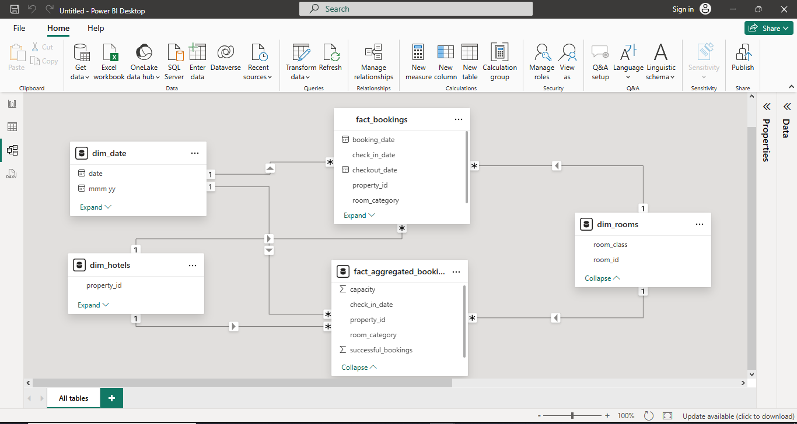
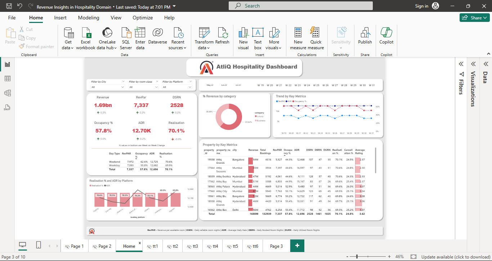

# 🏨 Revenue Insights in Hospitality Domain

## 📊 Project Overview
This Power BI project provides data-driven insights into the **hospitality domain**, focusing on **revenue analysis**, **occupancy trends**, and **key performance metrics** across multiple hotels and booking platforms.  
The goal of this dashboard is to help hospitality management teams make informed decisions to **optimize revenue**, **improve occupancy**, and **enhance customer satisfaction**.

---

## 🧩 Key Objectives
- Analyze **total revenue**, **RevPAR (Revenue per Available Room)**, **ADR (Average Daily Rate)**, and **DSRN (Daily Sold Room Nights)**.
- Compare **occupancy rates** and **realization %** across different cities, room classes, and booking platforms.
- Identify trends in **customer behavior**, **cancellations**, and **average ratings**.
- Provide a visual summary for **management and strategy planning**.

---

## 🗂️ Data Model (Star Schema)
The data model follows a **star schema** design, which includes:
- **Fact Tables:**
  - `fact_bookings`
  - `fact_aggregated_bookings`
- **Dimension Tables:**
  - `dim_date`
  - `dim_hotels`
  - `dim_rooms`

---

## 📈 Dashboard Highlights
- **KPIs Displayed:**
  - Total Revenue, RevPAR, DSRN, Occupancy %, ADR, and Realization %
- **Interactive Filters:**
  - Filter by **City**, **Room Class**, and **Booking Platform**
- **Visual Insights:**
  - % Revenue by Category (Luxury vs Business)
  - Trend of Key Metrics (Revenue, ADR, Occupancy)
  - Property-wise performance table
  - Realization % and ADR by Platform

---

## ⚙️ Tools & Technologies
- **Power BI Desktop**
- **Data Modeling (Star Schema)**
- **DAX (Data Analysis Expressions)**

---

## 🚀 Insights Derived
- Weekday occupancy is slightly lower than weekends. (Note:Friday and Saturday is the Weekend for Hospitality Industry.)
- Certain platforms show higher ADR but lower realization rates.
- Top-performing properties contribute significantly to overall revenue.
- Business category accounts for higher % of total bookings compared to luxury.

---

## 📚 Learnings
- Understanding of **data modeling** and **relationships** in Power BI.
- Experience in **DAX calculations** and **visual storytelling**.
- Enhanced ability to derive insights from large datasets and present them effectively.

---

## 🏁 Conclusion
This project demonstrates the power of **Power BI** in turning raw data into actionable insights for the **hospitality industry**. It highlights the key performance areas that can help hotel managers maximize profitability and optimize business operations.

---

